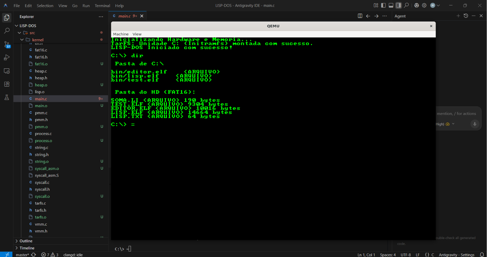
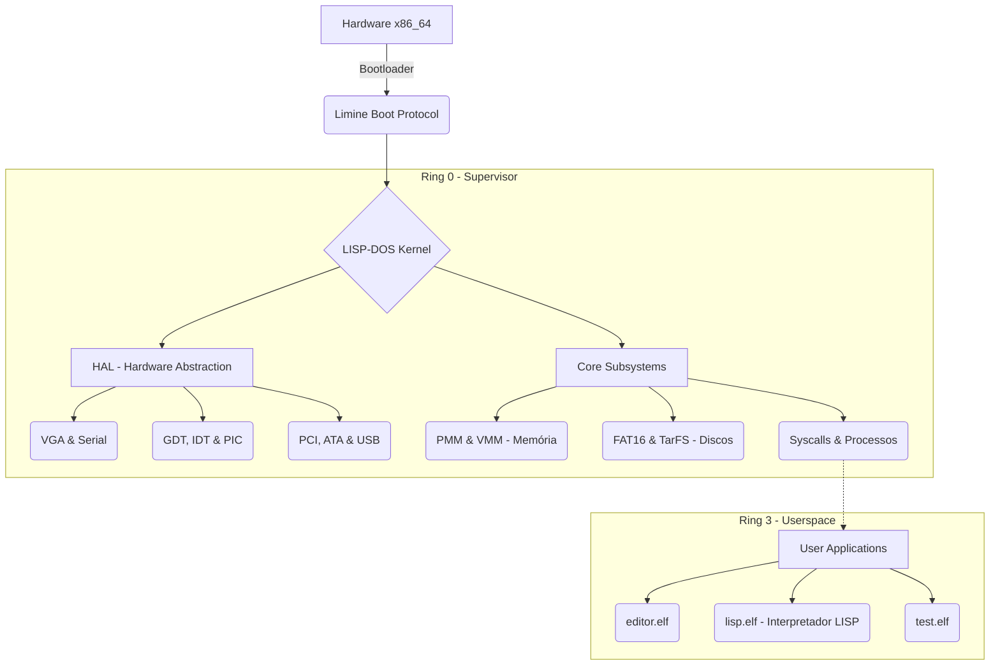

# LISP-DOS

O **LISP-DOS** é um sistema operacional minimalista, escrito do zero e projetado para a arquitetura x86_64. O objetivo central deste projeto é reavivar o sonho das clássicas "LISP Machines", trazendo um ambiente computacional onde o interpretador LISP roda nativamente próximo ao "bare metal", com abstrações reduzidas.



---

## 📜 Histórico de Desenvolvimento

A iniciativa nasceu da vontade de criar um ambiente de computação transparente e hackeável. 

* **Fase 1 (A Base):** O projeto foi inicializado adotando o protocolo de boot **Limine**, que delega o trabalho pesado da UEFI/BIOS e transição de modos do processador. O kernel foi iniciado já em **Long Mode (64 bits)**, abstraindo a transição do modo real (16-bit).
* **Fase 2 (HAL e Memória):** Implementação da camada HAL (Hardware Abstraction Layer), incluindo o VGA para saída de vídeo (texto), PS/2 para teclado, e a estruturação de GDT/IDT. A fundação de memória foi estabelecida com o Gerenciador Físico (PMM via bitmap) e Virtual (VMM com paginação em 4 níveis).
* **Fase 3 (Sistemas de Arquivo e Processos):** Implementação de File Systems básicos (TarFS para um Ramdisk e FAT16 para disco rígido ATA). Suporte a Ring-3 (User Mode) com Ring-0 Syscalls foi adicionado, permitindo que binários ELF isolados rodassem.
* **Fase 4 (Userspace LISP):** O `lisp.elf` começou a ganhar vida. Um interpretador minimalista rodando com suporte do kernel LISP-DOS!

---

## 🏗️ Arquitetura do Sistema

O LISP-DOS segue o design arquitetural de um kernel monolítico customizado com alta ênfase no desacoplamento da camada de hardware (`src/hal`) das rotinas lógicas principais (`src/kernel`). 

### Diagrama de Blocos



---

## 🧩 Módulos Implementados

O repositório está subdividido em camadas lógicas:

### 1. HAL (`src/hal/`)
- **Controladores Básicos:** Configuração de Tabela de Descritores (GDT/IDT) e Interrupções Programáveis (PIC).
- **Entrada/Saída:** Driver VGA em Modo Texto, Teclado PS/2 (`keyboard.c`), Portas Seriais (COM1 via `serial.c`).
- **Barramentos e Armazenamento:** Enumeração Básica do barramento PCI (`pci.c`), ACPI Básico (`acpi.c`), controlador de disco ATA em PIO Mode (`ata.c`), e esqueletos para suporte USB/xHCI (`usb.c`).

### 2. Core Kernel (`src/kernel/`)
- **Memória:** Gerenciamento Físico via Bitmap (PMM) e Virtual via Page Tables (VMM). Heap allocator nativo (`malloc`/`free` básicos em `heap.c`).
- **Arquivos (VFS/Drivers):** Suporte nativo à leitura de partições **FAT16** (`fat16.c`) para carga de aplicativos e leitura de um Ramdisk (`tarfs.c`).
- **Tasking & Syscalls:** Lógica de agendamento de processos e troca de contexto de Ring-0 para Ring-3. Syscalls x86_64 nativas usando a instrução `syscall` do processador (`syscall.c` e `syscall_asm.S`).

### 3. Userspace e Ferramentas (`src/tools/`)
- **LISP Interpreter (`lisp.c`)**: Interpretador lisp básico rodando em modo de usuário.
- **Text Editor (`editor.c`)**: Um rudimentar editor de texto interativo.

---

## 🛠️ Guia de Compilação e Teste

Para compilar e testar o LISP-DOS, você precisará de um ambiente **Linux** (ou Ubuntu via **WSL2** no Windows).

### 1. Pré-requisitos
Instale os pacotes básicos de compilação C e ferramentas de criação de disco:
```bash
sudo apt update
sudo apt install build-essential mtools xorriso qemu-system-x86 git curl
```

### 2. Obtendo o Código
Clone o repositório do LISP-DOS e entre na pasta:
```bash
git clone https://github.com/LISP-DOS/LISP-DOS.git
cd LISP-DOS
```

### 3. Compilando e Executando
O projeto utiliza um `Makefile` automatizado. Ele fará o download da branch binária do Bootloader Limine, compilará o Kernel, criará a estrutura Ramdisk e o disco FAT16 (`hdd.img`).

- Para **Compilar** tudo do zero:
  ```bash
  make
  ```

- Para **Compilar e Rodar** no Emulador QEMU:
  ```bash
  make run
  ```

### 4. Limpeza de Ambiente
Para limpar arquivos-objeto e as imagens de disco geradas (útil para recompilar "do zero"):
```bash
make clean
```

---

*LISP-DOS: Despertando a máquina em S-expressions.*
